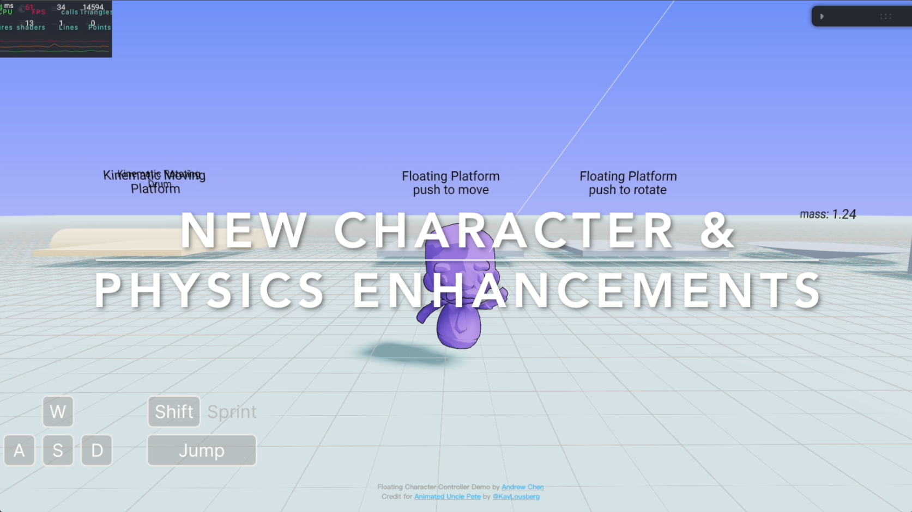
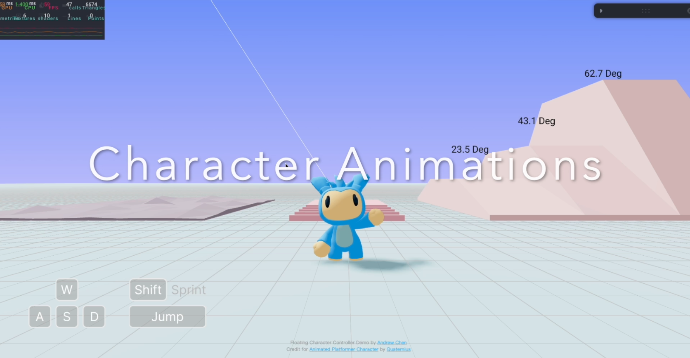

# Floating Capsule Character Controller

[](https://www.youtube.com/watch?v=7h4ydBeryK8)

Simple web based character controller build on [react-three-fiber](https://github.com/pmndrs/react-three-fiber) and [react-three-rapier](https://github.com/pmndrs/react-three-rapier). It provides a playground demo where you can experience the following features:

1. Seamless movement over small obstacles
2. Enhanced control with floating force incorporating spring and damping forces
3. Rigidbody character functionality for interaction with the game environment
4. Customizable ground friction for tailored control
5. Realistic simulation with applied mass on supporting surfaces
6. Smooth integration with moving and rotating platforms

## New Features

### (2023-09-13) New Character & Physics Enhancements:

- Incorporate 11 dynamic animations with new floating character, Uncle Pete
- Implement action and reaction forces on frictionless floating platforms:
  - Platforms now move opposite to the character's moving direction (Having less impact on havier platforms)
  - Character also applies drag force (friction) to the standing platform
  - Character's free fall height now impacts on platform reaction forces
  - Add extra downward force upon character jumps for more realistic physics
  
  [](https://github.com/erdongchen-andrew/CharacterControl/tree/main/example)

### (2023-08-28) Character Animations:

- Incorporate 8 built-in dynamic animations (including 3 for jump actions)
- Flexibility to add and personalize additional animations
- Fine-tune slope angle's impact on jump direction (fully customizable)
- Tailor the rejection velocity for sudden changes in movement direction (fully customizable)

  [](https://github.com/erdongchen-andrew/CharacterControl/tree/main/example)

### (2023-08-10) Camera Enhancement:

- Collision detection
- Zoom in/out capability
- Expanded movement range
- Improved tracking smoothness

### (2023-07-27) Character Auto Balance:

- Character tilts forward/backward while in motion
- Automatically returns to upright position after a hit or attack
- Stability customization: Users can fine-tune the balance sensitivity to match their gameplay style

## Project Link

Live Demo: [Floating Capsule Character Controller](https://character-control.vercel.app/)

## Setup

Download [Node.js](https://nodejs.org/en/download). Run this followed commands:

```bash
# Install dependencies (only the first time)
npm install

# Run the local server at localhost:8080
npm run dev

# Build for production in the dist/ directory
npm run build
```

## How To Use

### Basic Controls

To get started, set up your keyboard map using [KeyboardControls](https://github.com/pmndrs/drei#keyboardcontrols). Then, replace `<CharacterModel>` with `<YourModel>` inside `Experience.jsx`:

```js
/**
 * Keyboard control preset
 */
const keyboardMap = [
  { name: "forward", keys: ["ArrowUp", "KeyW"] },
  { name: "backward", keys: ["ArrowDown", "KeyS"] },
  { name: "leftward", keys: ["ArrowLeft", "KeyA"] },
  { name: "rightward", keys: ["ArrowRight", "KeyD"] },
  { name: "jump", keys: ["Space"] },
  { name: "run", keys: ["Shift"] },
  { name: "action1", keys: ["1"] },
  { name: "action2", keys: ["2"] },
  { name: "action3", keys: ["3"] },
  { name: "trigger", keys: ["KeyF"] },
];

return (
  <>
    ...
    <Physics debug={physics} timeStep="vary">
      {/* Keyboard preset */}
      <KeyboardControls map={keyboardMap}>
        {/* Character Control */}
        <CharacterController>
          {/* Replace your model here */}
          <CharacterModel />
        </CharacterController>
      </KeyboardControls>
      ...
    </Physics>
  </>
);
```

### Modifiy Character Animations

If you want use your own character animations, customize the `animationSet` in `CharacterModel.jsx` with your animation names. Also, make sure to adjust the `useGLTF` src to your model:

```js
// Change the character src to yours
  const { nodes, animations } = useGLTF("/Floating Character.glb");
  ...
// Rename your character animations here
  const animationSet = {
    idle: "Idle",
    walk: "Walk",
    run: "Run",
    jump: "Jump_Start",
    jumpIdle: "Jump_Idle",
    jumpLand: "Jump_Land",
    fall: "Climbing", // This is for falling from high sky
    wave: "Wave",
    dance: "Dance",
    cheer: "Cheer",
    attack: "Attack(1h)",
  };
```

### (Advanced) Add and Personalize Additional Animations

For advanced animation setups, follow these steps:

1. In `CharacterModel.jsx`, expand the `animationSet` with additional animations:

```js
// Rename your character animations here
const animationSet = {
  idle: "Idle",
  walk: "Walk",
  run: "Run",
  jump: "Jump_Start",
  jumpIdle: "Jump_Idle",
  jumpLand: "Jump_Land",
  fall: "Climbing",
  wave: "Wave",
  dance: "Dance",
  cheer: "Cheer",
  attack: "Attack(1h)",
  //additinalAnimation: "additinalAnimationName",
};
```

2. In `useGame.jsx`, create a trigger function for the new animation:

```js
  return {
      /**
       * Character animations state manegement
       */
      // Initial animation
      curAnimation: null,
      animationSet: {},

      ...

      wave: () => {
        set((state) => {
          if (state.curAnimation === state.animationSet.idle) {
            return { curAnimation: state.animationSet.wave };
          }
          return {};
        });
      },

      /**
       * Additional animations
       */
      // triggerFunction: ()=>{
      //    set((state) => {
      //        return { curAnimation: state.animationSet.additionalAnimation };
      //    });
      // }
    };
```

3. In `CharacterController.jsx`, initialize the trigger function and call it when needed:

```js
// Animation change functions
const idleAnimation = useGame((state) => state.idle);
const walkAnimation = useGame((state) => state.walk);
const runAnimation = useGame((state) => state.run);
const jumpAnimation = useGame((state) => state.jump);
const jumpIdleAnimation = useGame((state) => state.jumpIdle);
const jumpLandAnimation = useGame((state) => state.jumpLand);
const fallAnimation = useGame((state) => state.fall);
const waveAnimation = useGame((state) => state.wave);
const danceAnimation = useGame((state) => state.dance);
const cheerAnimation = useGame((state) => state.cheer);
const attackAnimation = useGame((state) => state.attack);
//const additionalAnimation = useGame((state) => state.triggerFunction);
```

## Contributions

I appreciate your interest in this project! If you have any feedback, suggestions, or resources related to the controller, please feel free to share.

Thank you!
